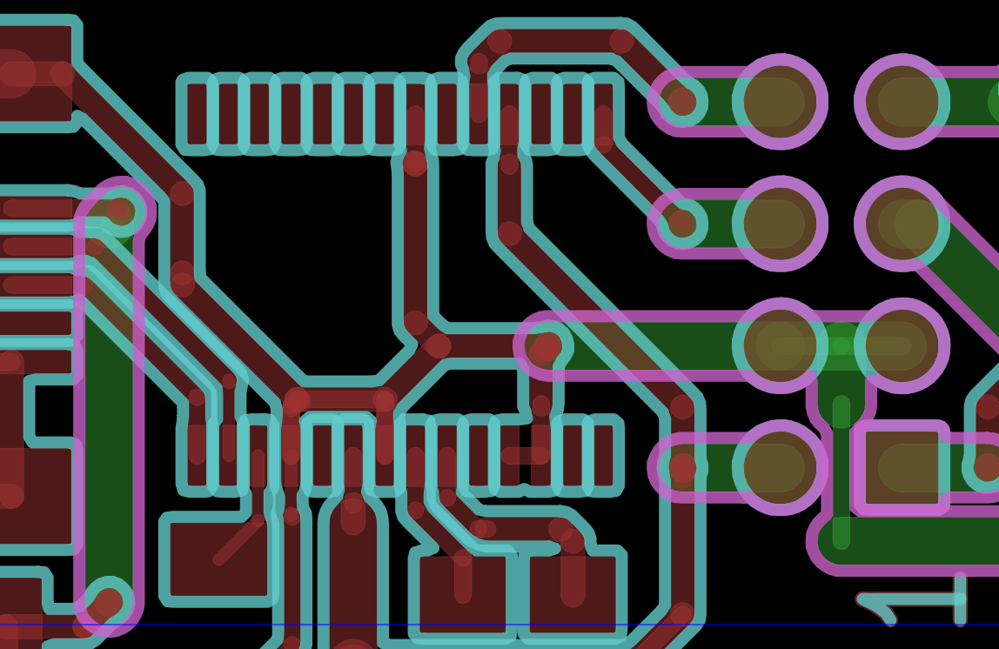

# CopperField

## Purpose
This software is used, to generate G-Code out of Gerber Files. 
Gerber is the default exchange format for manufacturing of printed circuit boards (PCBs). 
The G-Code is used to drive a CNC-milling machine to isolate the copper tracks. 

## Shortcuts
  * **G** G-Code settings
  * **L** Layer settings
  * **Space** Set relative coordinate origin
  * **M** Calculate milling paths
  * **Home** Zoom to whole drawing

## Still in Pre-Alpha-State
This programm is wirtten in Qt4 and is now in the process of porting it to Qt5. 
Some Demos are working, but there are still heavy bugs and many TODOs. 

If you have interest on this code, please contact me: karl@zeilhofer.co.at

## Screenshots
please have a look into the screenshots folder
